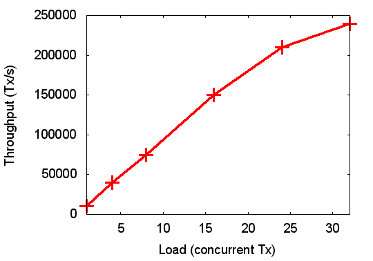
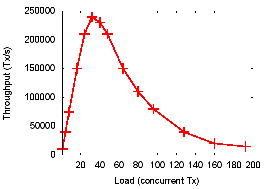
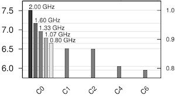
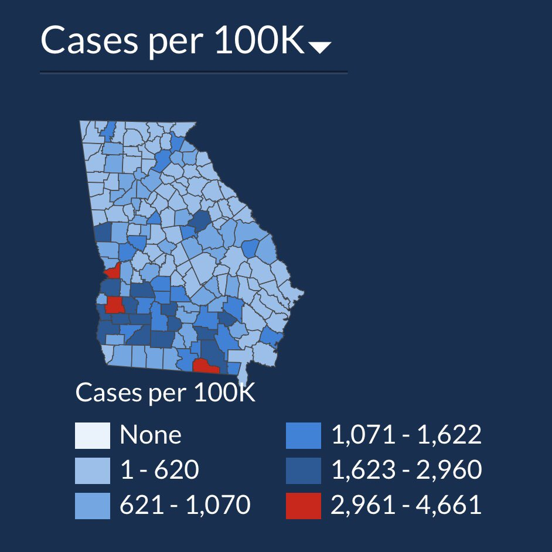

## 译者注
这篇论文是我在翻译 [Envoy 官方文档](https://www.envoyproxy.io/docs/envoy/latest/)的 FAQ：[Envoy 基准测试最佳实践](https://www.envoyproxy.io/docs/envoy/latest/faq/performance/how_to_benchmark_envoy)时看到的，这篇论文学术气息非常浓厚，作者思维之缜密，态度之严谨，令人折服。这篇文章中对基准测试的一些常见误区，还有考虑问题的角度，在我们平时处理问题的时候，我觉得很有借鉴意义。所以翻译过来和大家共同学习。

## 基准测试五宗罪

在审阅系统论文时（有时甚至在阅读已发表的论文时），我经常会遇到对基准测试极具误导性的使用。我并不是说作者有意误导读者，这大概率是作者能力有限。但这不是借口。

我称这类案件为基准测试犯罪。不是因为你会为了他们入狱（但可能应该这样做），而是因为它们破坏了科学过程的完整性。请放心，如果我是论文的审稿人，并且你的论文中包含其中一项的话，那么你基本上是会被拒绝的。除非剩下的工作非常不错，以至于能让我宽恕你的基准测试犯罪（即使那样，你也将被要求在最终版本中进行修复）。

以下列表正在处理中，当我遇到（或记起）更多基准测试犯罪的系统时，我会不断添加它。

## 选择性基准测试

这是所有基准测试犯罪的源头：使用一组有偏见的基准测试（似乎）证明了这一点，这可能与更广泛的评估空间相矛盾。这清楚地表明，最好的情况是能力有限，或者最坏的情况下是主动进行欺骗。

这种犯罪有几种变体，我列出了最突出的一种。显然，并非所有情况都同样糟糕，在某些情况下，这可能只是彻底程度的问题，但就其最明显的形式而言，这确实是一种可怕的犯罪。

### 不评估潜在的性能下降

对提高性能的技术/设计/实现进行公正的评估，实际上必须符合下面两个标准：

- 激进的标准：在特定的领域，性能确实得到了显着改善
- 保守的标准：性能不会在其他地方显着降低

两者都很重要！如果你只在一方面提高了性能而另一方面却降低了性能，就不能说你的做法是有效的。

现实情况是，提高性能的技术通常需要一定程度的额外工作：额外的统计，缓存等。这些事情总是有代价的，假装看不到这一点是不诚实的。系统的核心就在于：做出正确的取舍。因此，一种新技术总是会带来一些开销，并且你需要证明它们是可以接受的。

如果你的创新确实导致了一定程度的降级，那么你需要对其进行分析，并找到一种场景，这个场景需要证明一定程度的降级在给出其他补偿的情况下是可以接受的。但是，如果你仅评估对你的方法有益的方案，则说明你个骗子。不要做假设，不要找借口。

### 基准测试子级设置没有充分的依据

在 SPEC 基准测试中，我经常看到此变体（实际上可以是上一个变体的一个实例）。之所以将这些套件设计为套件是出于以下原因：代表各种工作负载，并强调一个系统的各个方面。

但是，也确实不可能在实验系统上运行所有 SPEC。一些 SPEC 程序需要大容量的内存（它们旨在给内存子系统做压力测试！），可能根本无法在特定平台（特别是嵌入式系统）上运行它们。还有一些是 FORTRAN 程序，其编译器都可能无法使用。

在这种情况下，不可避免地要选择套件的一个子集。但是，必须清楚地了解结果是有限的。特别是，如果使用子集，那么引用 SPEC 的所有优点（例如平均加速）是完全不可接受的！

如果使用了子集，则必须证明其合理性。每个缺少的子集都必须有令人信服的解释。并且讨论必须谨慎，不要只相信结果，请记住，所使用的子集所观察到的任何趋势，都可能与不在该子集中的程序相悖。

在违反上述规则的情况下，读者必定会怀疑作者试图隐藏某些东西。我对”我们选择了有代表性的子集“或“显示了典型结果”之类的说法特别敏感。SPEC 基准测试中就没有“代表性”子集，“典型”结果很可能就是为看起来最有利而被挑选的。对这样的罪行不要指望得到宽恕!

Lmbench 有点特殊情况。它的许可证实际上禁止报告部分结果，但是完整的 lmbench 运行会产生的结果太多了，以至于无法在会议论文中进行报告。另一方面，由于这是一组微观基准测试，它们正在探究操作系统的各个方面，因此人们通常会了解每种度量的内容，并且由于一些合理的理由可能只对某些子集感兴趣。在那种情况下，以明确定义的标准化方式运行特定的 lmbench 测试一个特定系统是有优势的。只要不过度依赖结果，这可能就可以了（并且 Larry McVoy 不会因许可证侵权而起诉你...）

这种犯罪的一种变种是**任意选择大量基准**。例如，当描述一种调试或优化 Linux 驱动程序的方法时，显然有成千上万的候选对象。全部使用它们可能是不可行的，你必须选择一个子集。但是，我想了解你选择特定的子集的理由。请注意，任意与随机不相同，随机选择就好了。但是，如果你的选择中包含许多小众或过时的设备，或者偏向于串行和 LED 驱动器，那么我怀疑你隐藏了一些信息。

###  选择某些数据集，然后隐藏对测试结果不利的数据集

这种变体也可以被视为第一种的例子。这里选择输入参数的范围是为了使系统看起来更好，但是这个范围不能代表实际的工作负载。例如，下面的图显示了吞吐量可以随着负载线性增长，如果没有进一步的细节，这看起来是一个不错的结果。

当我们将图放在上下文中时，情况看起来有些不同。假设这显示的是客户端数量不同的数据库系统的吞吐量（每秒事务数）。到目前为止，一切都很好。

如果我告诉你这是在 32 核计算机上测得的，它仍然很好吗？然后，我们看到，只要每个核最多有一个客户端，吞吐量就几乎呈线性增长。现在，这不完全是数据库的典型负载。通常，单笔交易不足以保持单核繁忙。为了充分利用硬件，你将需要运行数据库，以便每个核平均有多个客户端。

因此，有趣的数据范围从图形结束的地方开始！如果我们将负载增加到真正有趣的范围内，将会发生在下面的图表中。显然，事情不再那么乐观，实际上，可扩展性令人震惊！

注意，尽管有些抽象和简化，但这不是一个虚构的示例，它是从真实系统中提取的，第一个图等效于真实出版物中的图。第二张图本质上是在同一系统上独立测量的。就像他们说的那样，是基于真实的故事......

## 基准结果处理不当

### 假装微基准代表整体表现

微基准专门探究系统的特定方面。即使它们非常全面，也不能代表整个系统的性能。必须使用宏基准测试（代表现实世界的工作负载）来论述整体性能。

在极少数情况下，有一种特定的操作通常被认为是至关重要的，并且可以合理地将重大改进视为实际进展的象征。一个例子是微内核 IPC，长期以来它一直是瓶颈，因此将开销降低一个数量级可能是重要的结果。对于新的微内核，如果它能够匹配发布的最好的 IPC 性能，就表明它具有竞争力。

这种例外很少见，并且在大多数情况下，仅基于微基准对系统性能进行论证是不可接受的。

### 吞吐量降低 x％ ⇒ 开销为 x％

我审阅的论文大约有 10％ 构成了这种恶性犯罪。如果系统的吞吐量降低了一定百分比，那么增加的开销就不会与之完全相同。恰恰相反，在许多情况下，开销要高得多。为什么？

假设你有一个网络堆栈，在某些情况下可以达到一定的吞吐量，而修改后的网络堆栈则可以减少 10％ 的吞吐量。修改带来的开销是多少？

没有更多信息，就不可能回答这个问题。为什么吞吐量会下降？为了回答这个问题，我们首先需要了解决定吞吐量的因素。假设有足够多的传入数据需要处理，堆栈可以处理的数据量主要取决于两个因素：CPU 处理开销和延迟。

对实现的更改（不是协议！）将影响 CPU 处理开销以及延迟，但是它们对吞吐量的影响却大不相同。只要有可用的 CPU 周期，CPU 处理开销对吞吐量的影响就可以忽略不计，而延迟可能会（如果处理速度不够快，数据包将被丢弃）。另一方面，如果 CPU 满载，那么 CPU 处理开销的增加将直接转化为延迟。

网络在设计是可以容忍大量延迟的，因此它们（吞吐量）不应该对它（网络）很敏感。那么，当吞吐量下降时怎么回事？

答案是延迟时间已显著增加，表现是吞吐量的降低（可能远远超过观察到的吞吐量降低），或者 CPU 达到极限。而且，如果延迟增加一倍导致吞吐量下降 10％，那么称“10％ 的开销”可能不是很诚实，对吗？

如果吞吐量最初受 CPU 能力（满负荷处理器）限制，则 10％ 的吞吐量下降可以合理地解释为 CPU 开销增加了 10％，这可以合理地称为“10％ 的开销”。但是，如果在最初的系统上 CPU 负载为 60％，而在修改后的系统上 CPU 负载为 100％（导致性能下降）怎么办？还是“ 10％ 的开销”吗？

显然不是。在这种情况下，计算开销的一种公平方法是查看每位（bit）的 CPU 处理开销，该成本与 CPU 负载除以吞吐量成正比。从这个角度来看，开销增加了 85％。因此，我将其称为 85％ 的开销！

处理此类问题的另一种方法是让“空闲”的 CPU 处理部分工作负载，而不将额外的 CPU 上的负载包括在 CPU 处理开销中。那只是作弊。

最终结果提供的信息不完整，这使我们无法真正评估间接开销/成本，并导致巨大的低估。吞吐量比较必须始终与完整 CPU 负载的比较一起进行。对于 I/O 吞吐量，比较的正确方法是使用每位（bit）处理时间！

### 淡化开销

人们有很多种方法来可以使自己的开销看起来比实际的要小。

#### 6％→13％ 的管理费用增加了 7％

这是一个混淆了百分比与百分比的问题，[媒体](http://imgs.xkcd.com/comics/percentage_points.png)经常（由于能力有限）这样做。在技​​术出版物中这样做并不能作为借口。

因此，作者修改后的系统将处理开销从 6％（原系统的）增加到了 13％（其他系统的），并且他们却声称只增加了 7％ 的开销。当然，那完全是胡说八道！他们的开销增加了一倍以上，其系统还不如原来的一半好！

类似地，如果基线系统的 CPU 利用率为 26%，而你的更改导致的利用率为 46%，那么你并没有增加 20% 的负载，而是几乎增加了一倍！如果你考虑一下同样的实验在资源只有原来一半的机器上运行会发生什么，在 20% 声明中的不诚实就很明显了:负载将从 52% 增加到 92%，显然不是增加 20%!

#### 不正确的参考点

这是一种相对频繁使用相对开销作弊的方法：作者选择适合自己目的的分母。例如，基线等待时间为 60s，而作者的改进系统将其减少到 45s。然后，作者声称“原系统慢了 33％”（60/45 - 1 = 0.33）。或者，作者的系统（以某种方式改进，例如，更安全）会导致性能下降，将执行延迟增加到 80s，作者声称“性能仅下降25％”（1 - 60/80 = 0.25）。

这显然是不诚实的。原系统是基准，因此在计算相对性能时必须出现在分母中。这意味着在第一种情况下，正确的值是改善 25％（ 1 - 45/60），而在第二种情况下，正确的值是降低 33％（80/60 - 1）。

感谢 [Dan Tsafrir](https://www.cs.technion.ac.il/~dan/) 提醒我这个烦恼。

#### 其他有创造性的开销计算方法

一篇特别明显关于不正确计算开销的例子是在[这篇论文中](https://www.usenix.org/conference/atc14/technical-sessions/presentation/fu)（发表于 Usenix 的 ATC，一个声誉好的会议）。在表 3 中，系统调用 `stat` 的延迟时间从 0.39μs 增加到 2.28μs，几乎增长了六倍。然而，作者称其为“82.89％ 的下降”！（还要注意[伪精确性](http://gernot-heiser.org/style-guide.html#pseudoacc)；这不是犯罪，而是对数字的错误理解。）

值得赞扬的是，该论文的作者认识到该错误，并提交了勘误表，来改正开销数字。不过，令人震惊的是这篇文章居然通过了审稿人的审核。

### 没有体现出数据的重要性

原始平均值没有任何变化的迹象，可能会极具误导性，因为没有迹象表明结果的重要性。来自不同系统的结果之间的任何差异可能只是随机的。

为了表明重要性，必须至少引用标准偏差。系统通常以高度确定性的方式运行，在这种情况下，重复测量的标准偏差可能很小。在这种情况下，例如声明“所有标准偏差均低于 1％”可能就足够了。在这种情况下，如果我们正在观察的效果是 10％，那么读者可以合理地理解结果的重要性。

如有疑问，请使用学生 t-test 来检验其重要性。

同样，如果你用直线拟合数据，请至少引用一个回归系数（除非很明显有很多点，并且直线通过所有这些点）。

### 平均基准分数的算术平均值

算术平均值通常不适合从一组不同的基准中得出总分（除非各个基准的绝对执行时间具有实际意义）。特别是，如果对各个基准评分进行了标准化（例如，针对基准系统），则算术平均值没有任何意义。

计算平均值的正确方法（即得出一个优值指标）是使用分数的几何平均值[[Fleming & Wallace, CACM (29), p 218](http://dl.acm.org/citation.cfm?id=5673)]。

### 误导性的结果表述

提供正确的数字以愚弄读者得出错误的结论，这可能是能力有限，更可能是一种欺骗。这些案例大多数都属于马丁·加德纳（[Martin Gardner](https://en.wikipedia.org/wiki/Martin_Gardner)）所说的“滥用图表（chart abuse）”，我很喜欢这个术语。

滥用图表通常涉及对数值范围的操纵，通常是为了夸大效果，如下图所示。不管横坐标上的数量是多少，你可能都会给人留下印象，即改变该值会对纵坐标产生巨大的影响，毕竟它从几乎满到几乎是空的，对吗？当然，如果你实际查看这些单位，则会发现相关数值仅相差 21％。这可能重要，也可能不重要，但它与粗略看一下图表所显示的大致数量级变化相差甚远。

但是，相反的情况也可以成立，即使用数值范围来隐藏显著的变化。下面是一个很具有代表性的例子（感谢 [Baris Kasikci](https://twitter.com/bariskasikci) 的提示）：美国佐治亚州公共卫生部的 COVID-19 病例的每日更新会巧妙地调整数值范围，以使红色的数量（表示该县有很多人感染）变化不大。下面的两个图表分别来自 2020-07-02 和 2020-07-17 。

该网页说明：“此图表旨在帮助你了解疫情是在增长，趋于稳定还是在下降。”显然，它没有帮助理解疫情，反而掩盖了在 15 天之内病例增长 50％ 的情况。实际上，使用奇怪的非整数数字来定义色桶，很难相信这是偶然的。例如，在较旧的图表中，红色范围的上限是下限的 1.57 倍，而在较新的图表中，比率仅为 1.37。看起来很像是为了保持“热门”县的数量不变而选择的数值范围。很难相信这不是故意的欺骗。

## 使用错误的基准

### 给简化的模拟系统做基准测试

有时不可避免地要基于模拟系统进行评估。但是，这非常危险，因为模拟始终是模型，并且包含一组假设。

因此，必须确保仿真模型不会做出任何简化的假设，这将影响性能。同样重要的是，要让读者/审阅者清楚地知道，你确实已经确保了模型对于你的基准来说是真正具有代表性的。

对于如何做到这一点，很难给出一般的建议。我最好的建议是设身处地为读者着想，最好是让一个局外人来读你的论文，看看你的论据是否真的令人信服。

### 不恰当或具有误导性的基准测试

我看到人们使用基准测试来证明这一点，而实际上他们却几乎什么也没说（他们唯一能证明的就是真正糟糕的性能）。例如：

- 使用单处理器基准测试来实现多处理器可伸缩性

这一条看起来很幼稚，但这并不意味着你不会在（据说）成年人提交的论文中看到它。有人试图通过运行多个 SPEC CPU 基准测试的副本来证明其系统的多处理器可伸缩性。

当然，这些是不通信的单处理器程序。此外，它们只执行很少的系统调用，因此不使用 OS 或底层通信基础设施。它们应该能够很好地扩展(至少对于低处理器计数而言)。否则，操作系统或硬件就会出现严重故障。真正的可伸缩性测试将运行跨处理器通信和使用系统调用的工作负载。

- 使用 CPU 密集型基准测试来展示网络开销

再说一遍，这看起来很愚蠢(或者说就是很愚蠢)，但我还是看到过。人们试图通过测量 CPU 密集型基准测试的性能降低来证明他们对网卡驱动程序或网络堆栈的更改对性能的影响很低。同样，这唯一可能证明的是性能糟透了，与性能降低毫无关系!

### 校准和验证使用相同的数据集

这是一种相当普遍的犯罪行为，坦率地说，这让我们的纪律感到尴尬。

系统经常使用必须根据操作条件（例如平台，工作负载等）进行校准的模型。这是通过一些校准工作量完成的。然后评估系统，运行评估工作负载，以显示模型的准确性。

校准和评估工作负载必须是不同的，这是不言而喻的，但显然不是！事实上，它们一定是完全脱节的。令人难以置信的是，有多少作者公然违反了这条简单的规则。

当然，使用相同数据进行校准和验证的结果，很可能使模型看起来是准确的，毕竟，它的设计是为了符合实验结果。但这样的实验只能说明模型与现有数据的吻合程度有多好。它对模型的预测能力没有任何意义，但是对未来测量的预测就是模型的全部意义所在!

## 不适当的基准结果比较

### 没有适当的基线

本案与上述案件有关。一个典型的例子是比较不同的虚拟化方法，只显示两个虚拟化系统的性能，而不显示真实的基线情况（显然是本机系统）。与本机的比较决定了什么是好是坏，而不是与任意虚拟化解决方案的比较!

请仔细考虑基线。通常它是最先进的解决方案。通常它是最优（或理论上最好）的解决方案或硬件限制（假设软件开销为零）。最优解决方案通常不可能在系统中实现，因为它需要未来的知识或神奇的零成本软件，但它通常可以在“外部”系统中计算出来，是一个很好的对照标准。在其他情况下，正确的基准在某种意义上是不受干扰的系统（如上述虚拟化示例中所示）。

### 只对自己进行评估

这是上述犯罪的一种变体，但这并不罕见。与去年的论文相比，你已经提高了系统的性能，这可能使你感到兴奋，但我发现它并不那么令人兴奋。我想了解其重要性，这意味着要与一些公认的标准进行比较。

至少这种罪行比其他罪行的危害要小，因为这是相当明显的，而且很少有审阅者会相信它。

这种犯罪还有一种更微妙的变体：对模型自身进行评估。有人建立了一个系统模型，做了许多简化的假设，并不是所有的假设都明显有效。他们为这个问题建立一个解决方案，然后在一个包含完全相同假设的模拟系统上评估这个解决方案。当然，结果看起来很好，但它们也完全没有价值，因为它们缺乏最基本的现实检查。这个我在已经发表的论文中找到了很多。很失望...

### 对竞争对手基准测试采用不公平的方案

你自己对你的竞争对手做基准是很棘手的，你必须努力确保你没有对他们不公平。我相信你已经对你的系统做了足够的调整，但是你真的在替代方案上做了同样的努力吗?

为了让读者/审阅者确信你的评价是公平的，请清楚描述你对竞争对手系统所做的工作，例如完整地描述所有配置参数等。如果你的测试结果与竞争对手系统公布的数据不符，请特别小心。如果有疑问，联系该系统的作者，以确认你的测量是公平的。

还有，我在一篇已发表的论文中看到了这种基准滥用的案例，在这种情况下，“竞争对手”系统是我的。该论文的作者未能提供有关他们如何运行我的系统的任何数据，我强烈怀疑他们弄错了它。例如，我们的开源版本的默认配置开启了调试功能。禁用该选项（当然，在任何生产设置和任何严谨的性能评估中，你都应该禁用该选项）可以大大提高性能。

总之，当你自己对竞争对手的系统进行基准测试时，必须格外小心。次优运行别人的系统很容易，以次优结果作为比较的依据是极不道德的，可能构成科学的不端行为。在这种情况下，马虎不是借口！

## 缺少信息

### 缺少评估平台的规范

为了重现性，评估平台必须有明确的规范，包括可能影响结果的所有特征，这一点至关重要。平台包含硬件和软件。

细节很大程度上取决于所评估的内容，但至少我希望看到处理器架构、内核数量和时钟速率，以及内存大小。对于涉及网络的基准测试，网卡和交换机支持的吞吐量（如果有的话）。对于使用内存系统的基准测试，指定各级缓存的大小和关联性通常是很重要的。通常，列出 CPU 的型号、内核类型和微体系结构是很好的做法。

软件也是如此。详细说明你的操作系统和（如果使用的话）虚拟机管理程序，包括发行版本。编译器版本通常也很重要，其他工具的版本也可能如此。

### 缺少子基准测试结果

在运行基准测试套件（如 SPEC）时，仅引用该套件的所有优点通常是不够的。相反，展示各个子基准的性能是至关重要的。套件被设计为涵盖一系列负载条件，其中一些可能会从你的工作中受益，而另一些则相反。只提供总体分数在最坏的情况下会隐藏问题，在最好的情况下会减少从评估中获得的洞见。

### 只提供相对数字

总是给出完整的结果，而不仅仅是比率（除非分母是一个标准数字）。最好的情况是，只看到相对数字会让我怀疑这些数字是否有意义，这样我就失去了执行完整性检查的简单方法。在最坏的情况下，它可以掩盖一个非常糟糕的结果，或者非常不相干的结果。

我所见过的最严重的这种犯罪不是在我审阅的论文中，而是实际发表的论文。它通过显示开销的比率来比较两个系统的性能：两个相对差异的比率。这太过相对性了，不能从这些数字中读出任何东西。

例如，假设一个系统的开销是另一个系统的两倍。它本身告诉我们的很少。也许我们在比较 10 倍和 20 倍的开销。如果是这样，谁在乎呢?两者都很可能无法使用。或者一个系统的开销是 0.1%，谁会在意另一个系统的开销是 0.2% 呢？总之我们不知道结果有多重要，但表象暗示它是非常重要的。

## 读者练习

数一数[这篇文章](http://ieeexplore.ieee.org/xpls/abs_all.jsp?arnumber=4784874&tag=1)（发表在 IEEE CCNC'09）有多少基准测试犯罪（发表在 IEEE CCNC'09）。

## 基准最佳实践

以下是我告诉我的学生的基准测试规则。它有点面向操作系统，但基本原理普遍适用。

### 通用规则

- 开始实验时，请确保系统真正处于静止状态，并留出足够的时间以确保清除所有先前的数据。
- 让你的基准测试平台成为我们回归测试套件的一部分。
- 记录你在做什么。

### 测试数据和结果

- 始终验证要传输的数据。将某些内容写入磁盘或网络时，请先将其读回并与你编写的内容进行比较。在读取的时候，请检查你所读的内容是否正确。
- 在某些情况下，基准测试的时间会不合理的变长。如果是这样，那么在继续操作之前，请确保至少检查一次完整运行的数据。另外，在收集最终数字之前，请再次检查！
- 切勿一遍又一遍地使用相同的数据。确保每次运行都使用不同的数据。例如，在数据中具有时间戳或其他唯一标识符（如图形中的坐标和标签）。这是为了确保你实际上在读取正确的数据，而不是一些过时的缓存内容，错误的块等。
- 对同一数据点使用连续运行和单独运行的组合。例如，在同一点上至少连续执行两次（有助于确定不应有的缓存效果），并在获取其他一些点后再进行两次（以识别不应该存在的缓存情况）。仔细查看标准偏差。
- 反转测量顺序。这有助于识别测量之间的干扰。可以通过在两个方向上遍历数据点集来共同实现该点和上一个点。
- 不要只使用常规步伐或 2 的幂。你可能正在发现病理病例而没有注意到它。随机点可能是一个好主意。但是，不要只使用随机点，你可能会错过病理病例。病理病例的最佳候选者是 2n，2n-1，2n+1。
- 在比较不同配置的测量结果（通常是这样做的）时，请确保使用完全相同的点，而不仅仅是比较同一时间间隔内的图形。
- 当得到有趣的结果时，请检查你是否正在将苹果与苹果进行比较。例如，确保你要比较的两次运行之间的系统尽可能处于相同状态。例如，在某些情况下，Linux 上的基准测试结果会受到操作系统在物理内存中分配它们的位置的影响，这在连续运行之间有所不同（并且对物理寻址缓存中的冲突未命中产生了巨大影响）。

### 统计数据

- 始终多次运行，并检查标准偏差。当心异常变化。在我们进行的那种测量中，通常期望标准偏差小于 0.1％。如果你看到 >1％，则应引起注意。
- 在某些情况下，忽略最高点或最低点（但这仅应在适当的统计外层检测程序之后做）或仅查看这些点的底端是合理的。但是，只有在你真正知道自己在做什么的情况下，才使用这种选择性使用数据的方式，并在论文/报告中明确声明。

### 计时

- 使用大量迭代以改善统计信息并消除时钟粒度带来的差异。
- 运行没有时间限制的足够的热身迭代。
- 将你想计时的东西隔离到一个函数中（如果你正在计时系统调用，那么已经完成了）。系统调用本身就是一个函数
- 消除循环开销（不要仅仅因为它很小而消除它）。最可靠的方法是分别运行两个基准测试版本，除了用空操作代替实际调用（函数或系统调用）外，两个版本完全相同。在没有任何编译器优化的情况下运行循环（这就是为什么要将要计时的东西放在函数中很重要，但是这可能需要你分别处理函数开销）。
- 对上面的系统调用循环执行静态分析，并验证计时数字是否符合你的预测。
- 使用正确的统计数据，即使它们没有在期末论文中使用，方差检查是一个重要的全面检查。

## 更多信息

最近，我与我在 VU Amsterdam 的同事一起发表了（未经同行评审）关于[系统安全文献中基准测试犯罪的研究](https://arxiv.org/abs/1801.02381)，并得出了有趣的结果。它包含与大多数系统工作无关的另一类别，但绝对与安全工作无关。

在我的[高级操作系统课程](http://www.cse.unsw.edu.au/~cs9242/)中，我有一个关于性能评估的[讲座](http://www.cse.unsw.edu.au/~cs9242/current/lectures/)，其中讨论了许多此类基准测试犯罪，并提供了关于基准测试和性能分析的提示。

如果你是学生或早期职业研究人员，那么你可能也对我的[论文样式指南感兴趣](https://www.cse.unsw.edu.au/~gernot/style-guide.html)。
