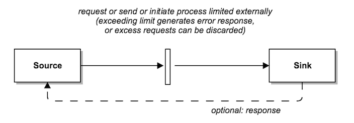
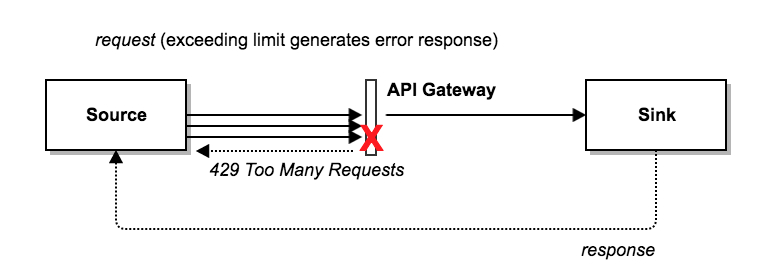
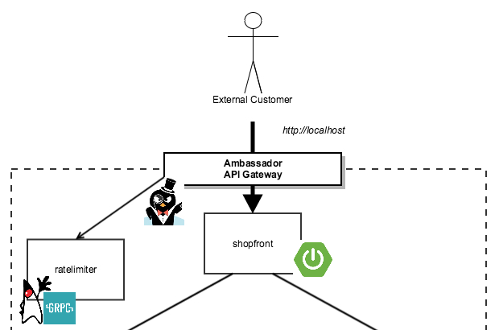

本文为翻译文章，[点击查看原文](https://blog.getambassador.io/rate-limiting-for-api-gateways-892310a2da02)。

在本速率限制系列的[第一篇文章](/blog/rate-limiting-a-useful-tool-with-distributed-systems-part1)中，介绍了实施速率限制的动机，并讨论了几种实施方案（取决于你是否同时作为通信的发送端和接收端）以及相关的权衡。本文会更加深入地探讨 API 网关速率限制的需求。

## 为什么 API 网关需要速率限制
在第一篇文章中，我讨论了在何处实施速率限制的几个选项：发送端、接收端或中间层（字面意思可以理解为发送端和接收端中间的服务）。

当通过公共 API 暴露你的应用程序时，通常你必须在接收端或中间层中实施速率限制。即使你控制了源代码（客户端）应用程序，你也希望防止会导致过多 API 请求的错误产生，同时应付可能会试图破坏客户端应用程序的不良行为者。

Stripe 博客有一篇精彩的关于“[用限速器扩展你的 API](https://stripe.com/blog/rate-limiters)”的文章，我将在本文中引用这篇文章，那篇文章的开头部分讨论了速率限制会如何帮助你在以下情况中让你的 API 更加可靠：

* 某位用户制造了流量洪峰，导致你的应用过载，而你的应用此时还需要为其他用户提供服务。
* 某位用户因为使用了行为不当的脚本，无意中向你发送了很多请求（相信我，这比你想象的要更频繁 - 我曾经亲自创建的压测脚本就意外触发了拒绝服务！）。又或者，更糟的情况是，某位用户试图故意让你的服务器过载。
* 用户向你发送很多优先级较低的请求，而你需要确保它不会影响高优先级的通信。例如，发送大量分析数据请求的用户可能会影响其他用户的关键事务。
* 系统中出现了某些内部问题，因此无法提供所有常规流量服务，并且需要丢弃低优先级的请求。

在 Datawire 工作期间，我们通常能够第一手地发现以上这些情况，特别是在那些暴露 “免费” 公共 API 的公司或者组织中，同时在这些组织中，也存在着明确的业务需求，即让付费用户优先使用流量，并且防止不良行为者（无论是有意或无意）。

## 速率限制和负载削减的基础知识
基本上，要理解速率限制的概念很简单。对于每个要限制的请求属性，只需统计属性的唯一实例出现次数，并在每个时间单位超过指定的计数时拒绝服务相关的请求。例如，如果你想限制每个客户端发出的请求数量，你将使用“客户端标识”属性（可能通过字符串键值为 `clientID` 的请求参数或直接包含在请求头部中），并为标识符保留一个计数器。

你还可以指定单位时间的最大请求数，并且定义一个计数递减算法，而不是在每个单位时间开始时重置计数器（稍后会详细介绍）。 当请求到达 API 网关时，它会递增相应的请求计数器并检查这个递增是否超过单位时间内最大允许请求数。 如果超过，则拒绝这个请求，最常见的情况是向调用客户端返回 [“Too Many Requests” HTTP 429 状态码](https://developer.mozilla.org/en-US/docs/Web/HTTP/Status/429)。

与速率限制密切相关的是“负载削减”。两者的主要区别在于判定拒绝请求的条件。速率限制是基于单个请求的属性（例如 clientId），而负载削减是基于应用的总体状态（例如，处于高负载的数据库）。如果系统仍处于部分运行状态，但是需要时间来恢复（或修复），则在流量入口点削减负载可以大量减少线上事故。

## API 网关存在的挑战
大多数开源和商业 API 网关都提供速率限制，但在众多实现中，普遍存在的挑战之一就是可扩展性。在单个计算实例上运行 API 网关相对简单，这意味着你可以将速率限制的计数器保留在单机内存中。比如你是对 clientId 进行速率限制，则只需在内存映射中检查并设置（增加）关联 clientId 的整数计数器即可。但是，此方法不能扩展单个实例到网关实例集群。

我见过一些开发人员试图通过使用粘性会话或将可允许请求的总数除以速率限制实例的数量来解决此限制。但是，这样做的问题在于，在高度动态的“云原生”环境中部署和运行应用程序时，这些方法都无法可靠地工作，因为在这种环境中，实例随时会被销毁并按需重建，或是动态扩容的。

克服此限制的最佳解决方案是使用某种形式的高性能集中式数据存储来管理请求计数。例如，在 Lyft，该团队使用 [Redis](https://redis.io/)（大概是作为高可用的 Redis Sentinel 集群运行），通过他们的 Envoy 代理统计[速率限制的指标](https://www.envoyproxy.io/docs/envoy/latest/intro/arch_overview/global_rate_limiting.html)，而该代理通过 sidecar 模式部署到所有服务和数据存储上。这种方法需要注意一些潜在的问题，特别是在 Redis 的检查和设置操作的原子性方面。出于性能原因通常建议避免使用锁机制，而 [Stripe](https://gist.github.com/ptarjan/e38f45f2dfe601419ca3af937fff574d) 和 [Figma](https://blog.figma.com/an-alternative-approach-to-rate-limiting-f8a06cf7c94c) 通过在 Redis 引擎中使用 Lua 脚本功能保证原子性。

另一个经常遇到的挑战涉及如何提取请求（元）数据用于决策速率限制，或者指定（或实现）用于确定是否应该拒绝特定请求的相关算法。理想情况下，你希望能够通过客户端属性（例如请求HTTP方法，位置，设备等）和后台属性（例如服务端点，由用户还是应用程序发起的请求等类似的语义信息以及期望的有效负载）来决策速率限制。

## 通过外部服务实施速率限制
针对上一节讨论的许多挑战，[Lyft 工程团队](https://eng.lyft.com/announcing-ratelimit-c2e8f3182555)去年提出了一个有趣的解决方案，当时他们谈论了他们如何使用 Envoy 代理（我们现在叫的名字）作为服务网格，通过为每个请求调用外部 [RateLimit](https://github.com/lyft/ratelimit) 服务来实现限制速率。 RateLimit 服务符合[这里](https://github.com/lyft/ratelimit/blob/master/proto/ratelimit/ratelimit.proto)定义的速率限制 Protobuf 协议，而这实际上就是一个速率限制 API。 Datawire 团队已经在 Envoy 代理之上构建了开源 Ambassador API 网关，同时最近 [Alex Gervais](https://twitter.com/alex_gervais) 已经为 Ambassador 提供了相同的[速率限制支持](https://blog.getambassador.io/ambassador-adds-rate-limiting-support-in-0-31-595cc8f91e49)。

由于你现在可以访问一个基于 Protobuf 速率限制服务 API，因此你可以使用任何你喜欢的语言（或至少是任何支持 Protobuf 的现代化语言）来实现拥有速率限制的服务。你现在还可以完全自由地在服务中实现任何你喜欢的速率限制算法，并且基于任何你想要传递给服务的元数据来制定速率限制策略。 Lyft RateLimit 服务中的[示例](https://github.com/lyft/ratelimit#user-content-examples)提供了一些有趣的灵感！值得一提的是，由于 Ambassador API 网关在 Kubernetes 内部运行，你创建的任何限制速率的服务都可以利用 Kubernetes 来处理扩展和容错。

## 关于系列文章的下一篇
在我们的速率限制系列的第二篇文章中，阐述了在 API 网关实施速率限制和负载削减的动机，并且还探讨了实施过程中可能遇到的一些挑战。 在文章的最后一节中，我提出了一些在现代云平台（如Kubernetes，ECS等）中部署集成有速率限制 API 网关的想法，并讨论了如何使用外部服务来实现这一切，以达到在实施你对速率限制算法的要求的同时，还能提供很大灵活性。

下周我们将发布本系列的最后一部分，我们将介绍如何利用 Java 为 Ambassador API 网关实施速率限制服务（[代码链接](https://github.com/danielbryantuk/ambassador-java-rate-limiter/blob/master/src/main/java/io/datawire/ambassador/ratelimiter/simpleimpl/RateLimitServer.java)）。

同时，请随时通过电子邮件发送任何问题，或到 Ambassador 的 [Gitter 频道](https://gitter.im/datawire/ambassador)。
